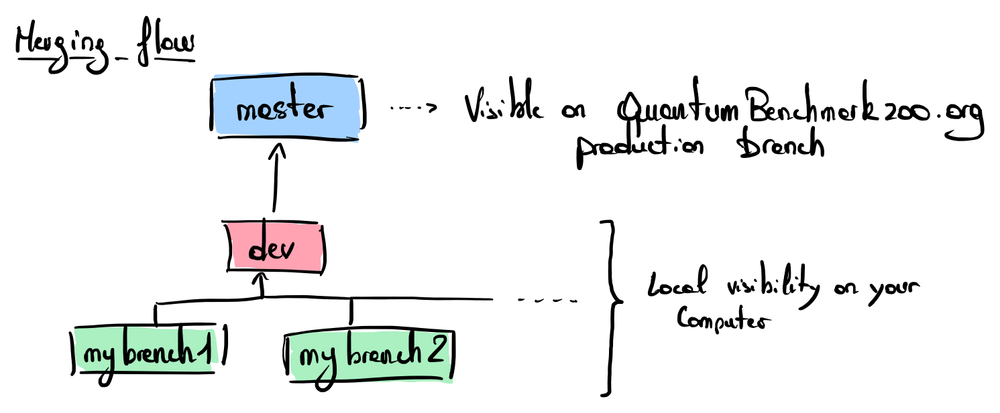

# Git good practices

Here is a list of practices we currently use to manage the content of the quantum benchmark at our best. These recommendations are likely to evolve soon.

## Branches

If you are working on creating new content, we recommend creating branches with the specific name of the protocol you are working on. You should create your branch from the 'dev' branch. Minor fixes and enhancements can be directly done on the dev branch.

To go on the branch 'dev', use the following command line:
```
git checkout dev
```

Then, create a new branch:
```
git branch mybranch
```

Push your branch on the git:
```
git push -u origin mybranch
```

The merging flow is the following: 



Merging your branch into the dev branch requires authorization, as well as merging dev into the master branch.  

To avoid troubles and push your work on the wrong branch, we advise you to add this prompt to your bashrc that will display the name of the branch you are currently working on: 
```
# get the current git branch 
parse_git_branch() {
     git branch 2> /dev/null | sed -e '/^[^*]/d' -e 's/* \(.*\)/ (\1)/'
}

# Add this: \[\033[33m\]$(parse_git_branch)
# to your PS1 constant name that defines the prompt of your terminal
# For example mine look like this:
export PS1='${debian_chroot:+($debian_chroot)}\[\033[01;32m\]\u@\h\[\033[33m\]$(parse_git_branch)\[\033[00m\]:\[\033[01;34m\]\w\[\033[00m\]\$ '
```

## Commit messages

We try to keep commit messages concise and clear following the [conventional commits](https://www.conventionalcommits.org/en/v1.0.0/) convention with the following keywords:
- feat: defines a new feature or content added to the zoo
- feat-update: defines an update of existing content on the zoo
- fix: defines a technical fix (do not depend on the scientific content of the zoo)

You can find examples of messages in the [past commits](https://github.com/v-gilbert/quantumbenchmarkzoo/commits/master/).