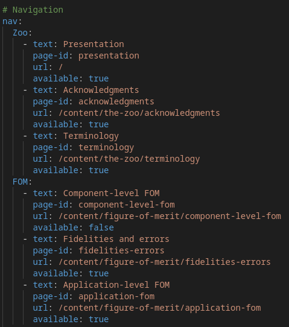
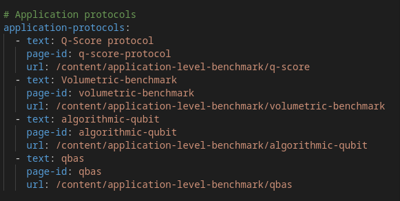

# Page creation tutorial

This tutorial is on creating a new page for the Quantum Benchmark Zoo. 

## Selecting the right folder

The pages of the website are stored in the directory 'content'. Folders organize the pages following the navigation bar structure of the website. For example, let's take a look at the submenu called "The Zoo" in the navigation bar: 

The menu title 'The Zoo' is not clickable. The three sub-menus 'Presentations', 'Acknowledgements', and 'Terminology' are clickable. The page 'Presentation' is the index of the website. The pages 'Acknowledgements' and 'Terminology' are in the directory content/the-zoo.

## Reference your page in the navigation (if needed)

This step is only required if you want your page to appear in the website's navigation bar. If you want your page to appear directly in the navigation bar (facultative), you have to modify the config.yml file accordingly. The navigation is organized as follows: 

Zoo is a sub-item of the navigation bar with three children: 'Presentation', 'Acknowledgments', and 'Terminology'. Each item has 4 properties: 
- **text**: text content that appears in the navigation bar on the website
- **page-id**: id of the page, should be unique
- **url**: URL of the page. It is basically the folder where the page is located
- **available**: Boolean that defines if the page is visible in the navigation bar.

## In any case, reference it

This step is required if your page was not referenced in the navigation bar. It is done in the _config.yml file. For example, pages like Q-score protocol are not directly referenced in the navigation bar but exist on the website and are accessible from other pages. These pages are referenced in the _config.yml file. An example is: 

Each page should have at least three properties: 
- **text**: Title of the page
- **page-id**: id of the page, should be unique
- **url**: URL of the page (folder where the page is located)

## Some tips

By default, if you just reference a folder name in the url, it will search for a file called index.md in this folder. For example, it's the case when referencing '/content/application-level-benchmark/applications' where it references the file '/content/application-level-benchmark/applications/index.md'

## Automated build

Once the page is created in the 'content' directory, it is automatically processed by jekyll to create the corresponding html page at each build. The pages automatically created are then inserted in the 